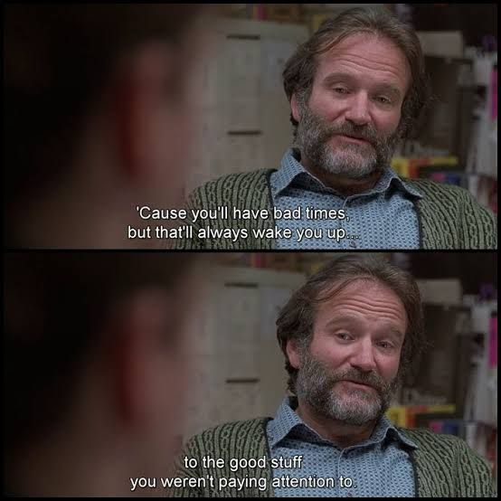
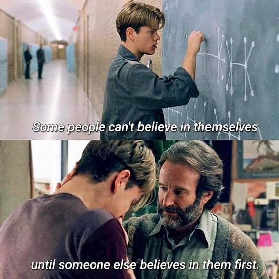
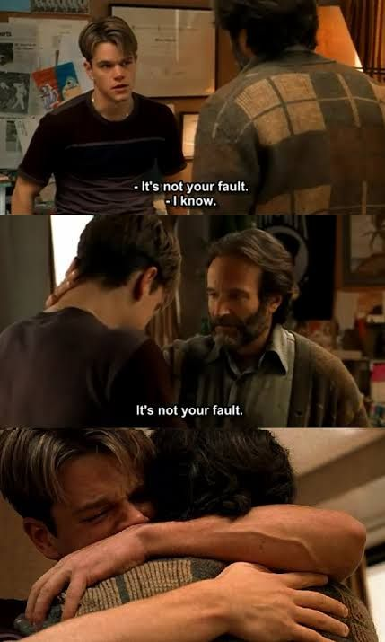

+++
author = "Prathipa"
title = "Movie Reflections: Rediscovering 'Good Will Hunting'"
date = "2024-03-01"
description = "After really a long time, I recently revisited a classic film, prompted by a friend who reminded me of 'Dead Poets Society', a personal favorite I had watched two years ago. As far as I can recall, this was the only movie I've ever written a review about."
categories = [
    "Movie"
]
tags = [
    "Movie Review", "Classic Film", "Good Will Hunting", "Emotional Healing", "Mentorship"
]
image = "4.jpeg"
+++

# Reconnecting with Movie Time

Well, reflecting on that, I realized it had been a long time since I indulged in some personal movie time at home. Despite having intended to watch another classic film featuring Robin Williams - "Good Will Hunting," I kept putting it off. Finally, I took the time to enjoy the movie today with a big glass of coffee, and it turned out to be a peaceful experience. It seems I was in an ‘okay’ mood today (yay!!), breaking the cycle of staring at walls, lying down, or simply engaging in solitary activities like reading and listening to music in the corner of my room. And you know what? I'm feeling a bit ‘wohooo’ and ready to review this movie and hype you all to watch the movie!!!

# "Good Will Hunting" - A Journey of Self-Discovery

So, "Good Will Hunting," is a 1997 classic movie, directed by Gus Van Sant. So, this movie is basically about the journey of Will Hunting, a super smart fellow, who's got some serious emotional baggage from his past messing with his head. The movie shows how having a mentor, like Dr. Sean Maguire, and being in touch with your feelings can help you figure yourself out. Through the character of Dr. Sean, it emphasizes the healing power of addressing emotional wounds and the importance of genuine connections. The movie also highlights the social class dynamics, illustrating the challenges faced by those from disadvantaged backgrounds. Ultimately, the movie conveys a message of personal responsibility, friendship, mentorship, and how being true to yourself can change everything.

 

# Memorable Dialogues and Scenes

Here are a few of my favorite dialogues from my favorite scenes;

"Some people can't believe in themselves until someone else believes in them first."
Dr. Sean drops this line, talking about how if you have someone who believes in you, it can transform your life. That's the vibe of this movie. Dr. Sean is the ultimate mentor, turning Will's life upside down (in a good way). It's like a crash course in how having a mentor can give your self-esteem and confidence a serious boost. The dialogue is a nod to how external encouragement can be a game-changer in helping people discover their true potential.

"It's not your fault."
Again from Dr. Sean during the last therapy session with Will. He repeats this phrase, breaking down Will's emotional walls and hitting the emotions of the audience. It brought tears to my eyes. The power of the line is that it hits right at Will's deep issues, letting out all the stuff he's been keeping inside. It shows how powerful empathy and understanding can be in therapy, and well, that’s how real therapy should be!

# Final Thoughts and Invitation to Share

Well, what are you waiting for? If you're reading this, yes, you! Go watch it! And if you've already seen it, you, my friend, do share your thoughts on how you liked the movie!




