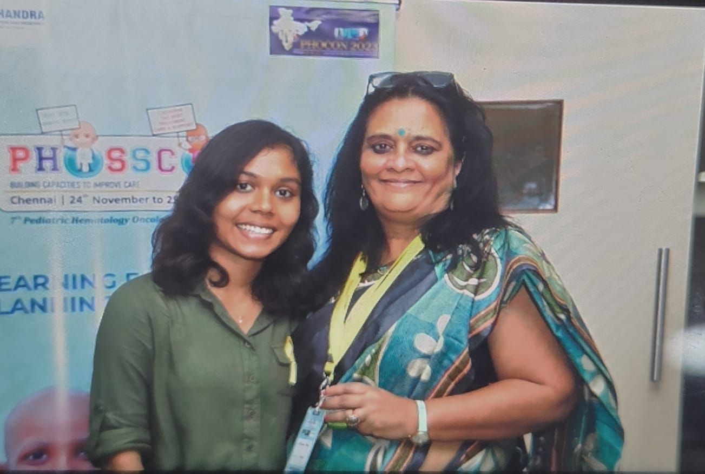

+++
author = "Prathipa"
title = "PHOSSCON 2023: A Transformative Experience"
date = "2023-11-25"
description = "Fortunate to have participated in the 7th PHOSSCON alongside the esteemed 26th annual PHOCON in Chennai, Tamil Nadu, an ##value gathering of thought leaders, advocates, and decision-makers dedicated to addressing the comprehensive needs of those affected by childhood cancer."
categories = [
    "Conference"
]
tags = [
    "PHOSSCON", "Childhood Cancer", "CSR Initiatives"
]
image = "cover.jpeg"
+++

## Meeting Inspirational Figures
I was delighted to meet Ms. Poonam Bagai, the founder of my organization, CanKids KidsCan. Her knowledge and dedication to her passion left a lasting impression on me. Her speeches throughout each session reflected her unwavering commitment and advocacy skills, and I feel fortunate to have got the opportunity to learn from the best.

Additionally, witnessing sessions by other impactful speakers from our organization was a highlight. Meeting everyone in person and having the opportunity to communicate was truly fulfilling. Sumita Kirti Nirbhay Singh Vishwajit Mitra Haresh Gupta

## Day 1 Session Highlights
Now, let me quickly provide a brief overview of the Day 1 session and share what specifically caught my interest. The sessions were enlightening, featuring discussions that ranged from the often-overlooked challenges faced by caregivers to the strategic nuances of building a robust CSR network.

## Caregivers' Challenges and Advocacy
The caregiver session, in particular, underscored the sacrifices made by families and emphasized the imperative to address the psychological aspects of caregiving. Advocacy, counseling, and awareness emerged as pivotal elements in enhancing caregivers' abilities to navigate challenging situations effectively.

## Building a Robust CSR Network
The CSR network building session provided a strategic blueprint, emphasizing the importance of branding, networking, and perseverance in the pursuit of support. The speaker's encouragement to confidently seek assistance and the emphasis on media's role in amplifying awareness resonated deeply.

## The Power of Storytelling in Fundraising
In another compelling session, the power of storytelling in fundraising took center stage. Crafting narratives that resonate with donors, understanding potential mismatches, and maintaining consistent communication were emphasized as critical components in sustaining donor relationships, a lesson I plan to integrate into my engagements with CSR initiatives.

## Application of Insights## 

Currently, as I embark on the journey of building networks and engaging with corporate social responsibility (CSR) initiatives at the hospital where I work, the insights gained from PHOSSCON 2023 are proving immensely beneficial. The event provided a comprehensive exploration of childhood cancer care, covering supportive and shared care, fundraising strategies, and perspectives from various NGOs.

## Conclusion

Grateful for this transformative experience, I look forward to applying these learnings in my endeavors, contributing to the advancement of childhood cancer awareness, and children's health care and support in general.




